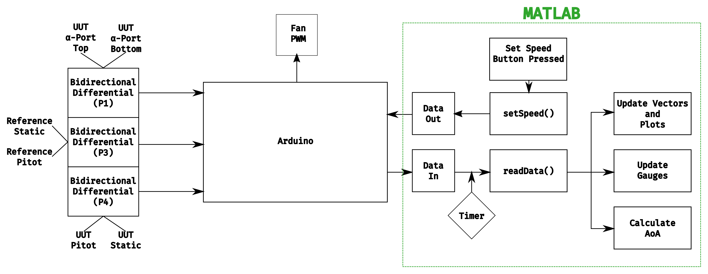

# DesktopWindTunnelDemo
User interfaces for desktop wind tunnel demo. Includes younger audience and professional audience versions.

# Installation Instructions
### Prerequisites for MATLAB Internal:
- At least MATLAB R2025a
- Curve Fitting Toolbox

### Prerequisites for Standalone Executable:
- MATLAB Runtime 25.1

## Run from source
You can choose to run the app from the source files or the provided package. To run from source, you
just need to clone the MATLAB Internal Files folder open the respective "Interface.mlapp" in MATLAB. It will run within MATLAB app designer and the addpath() feature may be required to add the Images and AoaData folders.

## Use the installation package
### Younger Audience Version
A MATLAB app installation package is provided in the Releases section found in the source folder. The only file needed is
"Interface" MATLAB toolbox. In MATLAB, navigate to the "APPS" ribbon tab, and select
"Install App". Open the toolbox file in the dialog that appears. The app should now be
accessible from the toolbar, titled 'Demo Wind Tunnel - Younger Audiences'.

### Older Audience Version
A MATLAB app installation package is provided in the appInstall folder. The only file needed is the 'WindTunnelInterface.mlappinstall'. In MATLAB, navigate to the 'APPS' ribbon tab, and select 'Install App'. Open the .mlappinstall in the dialog that appears. The app should now be accessible from the toolbar, titled 'WindTunnelInterface'.

## Run as Standalone Executable
The executable should already be installed on the designated demo laptop. If installing the executable on a new laptop for the first time, refer to: "L:\Engserv\AEA\Wind Tunnel Demos\Desktop Wind Tunnel Demo\A3 First-Time Executable Installation for Desktop WT.docx" for instructions. The files are available in this repository, as well as the network folder containing the instructions.

# Usage Instructions
Upon initializing the application, you need to select the serial port that the Arduino is connected
to. This is done with the dropdown menu shown, which should list all the available serial ports.
If the Arduino is plugged in after opening the app, then the refresh button can be used to fetch an
updated list of available ports. The COM port that was not available prior to plugging in the wind tunnel is the one that should be chosen.

**NOTE: If the wrong serial port is selected, then the app will likely crash. Choose wisely.**

# Arduino
The microcontroller program is located in the Arduino directory along with libraries that it depends
on. It sets up continual communication with the pressure sensors and outputs the values over the
serial port, including the calculated airspeed for Sensors 3 and 4. On initial startup, it computes
the density from an absolute pressure and temperature sensor.

Note that if you plan to compile and upload using the Arduino IDE, you will need to copy the
directory Arduino/libs/ams5915 to your Arduino libraries folder. This contains class definitions for
the AMS pressure sensors that are used in the Arduino program. This library was originally created
by Bolder Flight Systems and *slightly* modified for this project by James Johnson.

# Source files
The files located in src/ -- perhaps not the greatest name for the directory -- include various
Matlab scripts and the Matlab app. Some scripts only exist for feature testing and will be removed
later.

# User Interface Architecture


The overall idea is to have a timer in the Matlab GUI that continually updates the GUI after a
certain time interval. That update involves reading in data from the Arduino serial port that
contains the pressure and the airspeed or angle of attack. This information needs to be sent to the
respective GUI components, such as the plots and gauges.

The user also has the ability to select the speed at which the fan will run. This is taken care of
by a `setSpeed()` function that is called when the "Set Speed" button is pushed. It converts the
given airspeed to a power setting and queues up a value to write to serial asynchronously.

## Function Descriptions
### startupFcn()
This initializes the plotted data vectors to zero and configures the plots. It also populates the
serial port dropdown list with values obtained from the builtin `serialportlist` function. The timer
is initalized, but not started.

### readData()
This function reads the data from the Arduino. It does this by reading 3 lines and storing them in
an array of strings. These strings are then separated -- based on "Tab" delimiters -- and converted
to doubles. The output array looks as follows:
```
1    ######    ######
3    ######    ######
4    ######    ######
```
The first number corresponds to the pressure sensor. The second number is the differential pressure
in Pa. The final number will be either `0` or the calculated airspeed in m/s, depending on the
purpose of the sensor. Sensor 1 is a bidirectional differential pressure sensor used for the angle
of attack calculation. Sensors 3 and 4 are used for the reference and UUT dynamic pressures,
respectively.

After updating the vectors with a new data point at the end, the plots are updated using
`refreshdata`. See Matlab documentation for more information.

### updateGauge()
This function maps the measured AOA value to a point on the Measured AOA interface gauge and updates the airplane graphic to point to the value.

### startCloudDrag()
This function initializes the dragging callbacks for the cloud image on the wind tunnel speed slider.

### dragCloud()
This function moves the cloud image to the mouse position on the slider and updates the wind tunnel speed to match the nearest reading.

### stopCloudDrag()
This function stops the dragging callbacks for the cloud image on the wind tunnel speed slider.

### STOPSIGNButtonPushed()
This function sets the wind tunnel speed back to 0 m/s and adjusts the cloud position on the wind tunnel speed slider to match if the stop sign image is pressed.

### pressureLiftUpdate()
This function scales the balloon and weight images in the lift/weight relationship graphic based on the readings from the top and bottom alpha ports (dPA) to represent the lifting and weight effects of the pressure under/over the pitot probe. It also moves the system up and down to reflect a positive/negative measured AOA reading, and drops the airplane to the bottom of the screen if the airplane 'stalls' or the pitot probe measures an AOA over 30 degrees.

### airfoilPressureUpdate()
This function scales the pressure and velocity arrows in the speed/pressure relationship graphic based on the readings from the top and bottom alpha ports (dPA). It determines if which side of the pitot tube is experiencing a higher pressure, and scales the arrow to reflect that, while scaling the velocity arrow on the opposite side inversely. This represents the inverse relationship between pressure and velocity over an airfoil.

### Timer
The timer is activated when the user clicks the "Connect" button, and it is deleted if the app is
closed or the user clicks "Disconnect". When it is started, the selected serial port is also opened.

**NOTE: If one selects the wrong serial port, then the app will likely crash. Choose wisely.**

### Angle of Attack Calculation

The LookUpTable .m-file will read in data from an Arduino and use a lookup table
   with stored values for the differential pressures qCM and dPa based on a given AOA for a 
   pitot under testing.
   
   AOA = ƒ(dPA/qCM)
   ƒ = function: 3-D table lookup
   
   Nomenclature:

  AOA = Probe Angle of attack
  dPA = differential pressure between the top and bottom alpha ports
  qCM = Ptm-Psm = measured total pressure minus measured static pressure
  Psm = average of the two alpha ports
